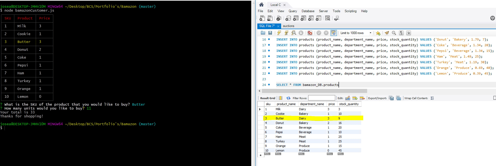

# Node.js-MySQL
---
## Overview:

* An Amazon-like storefront created with MySQL & Node.js. The app will take in orders from customers and * * deplete stock from the store's inventory.
---
# Accomplished for this app:

## 1. Created a MySQL Database called `bamazon`.

## 2. A Table inside of that database called `products`.

## 3. The products table has each of the following columns:

   * sku (unique id for each product)

   * product_name (Name of product)

   * department_name

   * price (cost to customer)

   * stock_quantity (how much of the product is available in stores)

## 4. Populated the database with 10 different products. (i.e. Insert "mock" data rows into this database and table).

   

## 5. Created a Node application called `bamazonCustomer.js`. Running this application will first display all of the items available for sale. Included are the skus, names, and prices of products for sale.

## 6. The app then prompts users with two messages.

   * The first asks them the SKU of the product they would like to buy.
   * The second message asks how many units of the product they would like to buy.

## 7. If your store _does_ have enough of the product, the customer's order is fulfilled by:
   * Updating the SQL database to reflect the remaining quantity.
   * Once the update goes through, the customer is shown the total cost of their purchase.
   
   
   

## 8. Once the customer has placed the order, the app checks if the store has enough of the product to meet the customer's request.

   * If not, the phrase `Insufficient quantity!` is shown, then the order is prevented from going through.

   

---
### Challenge #2: Manager View (Next Level)

* Created a Node application called `bamazonManager.js`. Running this application will:

  * List a set of menu options:
    * View Products for Sale
    * View Low Inventory
    * Add to Inventory
    * Add New Product

  * If a manager selects `View Products for Sale`, the app lists every available item: the item SKUs, names, prices, and quantities.

  * If a manager selects `View Low Inventory`, then it lists all items with an inventory count lower than five.

  * If a manager selects `Add to Inventory`, the app displays a prompt that will let the manager "add more" of any item currently in the store.

## 5/20/19
  * If a manager selects `Add New Product`, it allows the manager to add a completely new product to the store.

